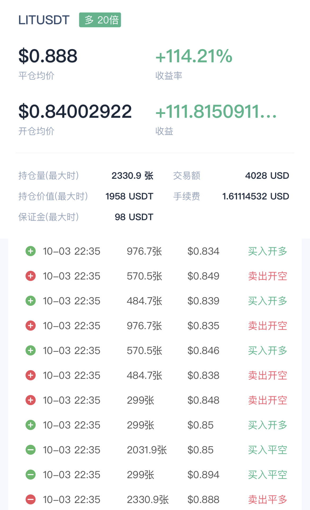
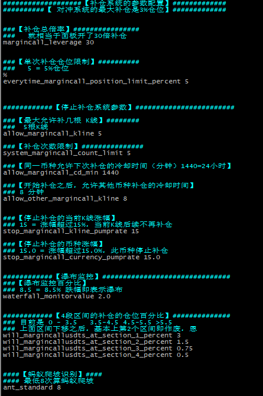
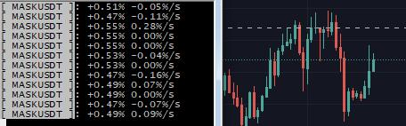

# 币安 对冲补仓系统

## Beginning

*郑重声明*
  - 本代码仅为了学习最前沿的区块链知识和技术。 
  - 之前一直放在本地，现在同步到github保存一下代码。 
  - 记录一下2022年的所有思路和灵感。
  - 任何使用本代码产生的一切后果与本人无关。 
  - 本代码只包含此种方式的做多补仓以及监控系统，可监控市场所有币种的任意波动并进行补仓。 
  - 内容过多，未包含全部内容
    - 做空、对冲、做多止损和做空止损、语音播报、一键跳转以及其他系统未包含在内。

*部分更新内容*

- WebsocketRequestImpl 524行 增加持仓方向PositionSide : ps
- WebsocketRequestImpl 480行修复json解析错误
- WebsocketRequestImpl 465行修复json解析错误
- WebsocketRequestImpl 516行修复json解析错误
- WebsocketRequestImpl 470行添加 事件原因
- RestApiRequestImpl 34行 去掉打印
- 断线重连
  - https://github.com/yonathan95/BinanceTradingBot/issues/8
  - https://github.com/Binance-docs/Binance_Futures_Java/pull/40
- RestApiInvoker 29 38 48 64 75行 添加errorCode
- BinanceApiException 添加属性 errorCode
- 移除RestApiRequestImpl中所有lambda
- 移除WebsocketRequestImpl中所有lambda
- WebsocketRequestImpl 716行，添加对倍率调整事件的解析
- 等

### 效果演示
  - 由于全参数开放性，所以实际效果完全取决于对市场的理解，举例，一次成功的高频对冲效果如下
    - bcoin不显示毫秒，本地保存所有订单精确到毫秒的全息日志
    - 共耗时10秒左右
  - 

### 已完成并实现的系统功能有
- [K线实时分析系统]()
- [动态速率分析系统]()
- [自动止损系统]()
- [一键平仓系统]()
- [动态止盈系统]()
  - 并可接收键盘输入实时动态止盈
- [进程间通讯系统]()
  - 服务器返回内容实时传输到币安客户端
- [离线监控系统]()
- [蚂蚁爬坡系统]()
- [多窗口分段展示系统]()
- [LUA实现的一键切换系统]()
- [永不断线系统]()
  - 所有系统均可断线自动重连，且原代码流程不会发生变化
  - 核心系统本地断电后仍然在运行
- [3段采样的全自动补仓系统]()
- [全频段全自动补仓系统]()
- [语音播报系统]()
- [账户倍率限制系统]()
  - 任何时刻账户最大倍率为10倍，人为无法干预
- [账户多单限制系统]()
  - 任何时刻账户不支持做多，人为无法干预
- [移动止盈止损系统]()
  - 动态止盈
  - 动态止损
- [全息数据复盘系统]()
  - 全息数据获取
    - 感知市场的每一次律动
    - 感知每一笔订单的盈亏信息
    - 精确到毫秒
    - 还原所有决策

### 大致包含的内容有
- [只做多补仓]()
- [只做空补仓]()
- [对冲补仓]()
- [可动态配置补仓]()
- [K线冷却系统]()
- [自动止损]()
- [自动止盈]()
- [移动止盈止损]()
- [可动态配置止盈止损]()
- [竟态平仓]()
- [断线重连]()
- [波动率计算]()
- [极限性能考虑]()
- [抗地震系统]()
- [双AC对冲]()
- [一键跳转系统]()
- [语音播报系统]()
- [全息日志系统]()
- [极限对冲]()
- [所有参数可配置]()
- [离线监控]()
- [复利]()
- [全息实时复盘系统]()
- [瀑布监控]()
- [牛熊指标切换系统]()
- [人性化提醒]()
- [可配置币种]()
- [动态参数加载]()
- [倍率永久限制]()
- [一键倍率修改]()
- [一键仓位模型修]()
- [不同区间分段差异化仓位]()

### 所有系统架构简介
- [系统运行于香港服务器]()
  - 与币安服务器的ping值稳定在1.5毫秒左右
- [用SecureCRT Version 8.7.3 (x64 build 2279) 进行访问]()
  - 支持任意位置跳转
  - 支持自定义按钮
    - 支持按钮颜色
    - 支持多列按钮
    - 支持移动按钮
    - 支持复制按钮
  - 支持多个进程
- [9个进程为最小系统]()
  - 前3个进程为自动倍率系统+空军速率系统+全频段自动补仓系统
  - 3-6为3段采样自动补仓系统
  - 6-9为全自动止损系统+自动更新配置系统+倍率限制系统+多单限制系统
- [采用可中断+不可中断系统架构]()
  - 补仓系统可随时中断，某些行情必须要中断
  - 止损系统在交易时间段内任何时刻不允许中断，也无法立即中断
  - 所有系统只运行于交易时间内，交易时间外无法启动
- [高性能高可靠性]()
  - 1ms的补仓位置差距可带来0.1%的价格差距
  - 系统中的每一行代码，每一个数据结构均最大限度的考虑了性能和稳定性
    - 添加了几个V2.0的接口
    - 添加了几个未实现的功能
    - 解决了诸多报错
    - 移除所有Lambda
- [从0到1的构建]()
  - 需要结合手稿、结合README.md以及代码和代码说明才能看清全貌
  - 同一份代码，以极其精妙的构思和巧妙的设计，将不同的代码和功能高性能的运行于不同的进程当中
  - 所有一切功能实现和代码的添加，都要以绝对不能降低补仓系统性能为前提。因为1毫秒的补仓位置差距，可能带来0.1%x10=1%的经济损失。
### 自动止损系统简介
- [总思想]()
  - [风险控制]()
    - 从2021年519到LUNA之间，经历过无数次的大的罕见旱情
    - 包含很多从死人堆里爬出来的教训
      - 用尽了从未用尽过的努力
        - 用尽了从未用尽过的智力
        - 用尽了从未用尽过的体力
        - 用尽了从未用尽过的忍耐力
        - 经历过无数的爆仓以及痛定思痛
        - 经历过无数次的自我怀疑
        - 经历过无数次的重新出发
    - 那是从未体验过的绝望
      - 自以为的一切努力，最终被市场狠狠的教育: you are SB
      - 从真正的绝境中走过2到3次
  - [任何时刻，限制账户亏损，永远执行]()
    - 任何策略，任何战法，任何套路，在金融市场里面都存在不适用的情况
      - 而这种情况的唯一解就是止损
      - 并且很多模型由于人性的弱点是来不及并且不会止损的
      - 所以必须要全自动止损
      - 并且要做到7X24小时除了服务器炸掉之外，不停止
      - 因此，任何情况下不允许中断
- [举例]()
  - 6月8号的 BLZ
  - 6月9号的 BAND
  - LUNA事件
  - LUNA之后底部反弹的无脑爆拉 RSR WAVES OGN模型
  - UNFI 1000%
  - 等等等

- [系统特征]()
  - 举例：当达到1.6%亏损时，发出提醒
  - 举例：当达到2%亏损时，无条件平仓
  - 举例：当持仓达到指定时间时，无条件平仓
  - 永久运行
    - 止损进程一旦开始运行，无法退出系统
    - screen配合中断屏蔽保证第一人间人为无法干预止损
    - 从潜意识断掉退出的念想

### 自动补仓系统简介
- [总思想]()
  - [光速补仓]()
    - 1ms以内全自动补仓
    - 多线程补仓
  - [对冲补仓]()
    - 可设置只做多
    - 可设置只做空
    - 可设置对冲补仓
  - [总仓位限制]()
    - 自定义首单(可配置)
    - 限制首单范围(可配置)
    - 限制补仓次数(可配置)
    - 限制补仓涨幅(可配置)
  - [自定义补仓曲线]()
      - 马丁补仓(可配置)
      - 2次幂补仓(可配置)
      - 3次幂补仓(可配置)
      - 自定义幂补仓(可配置)
      - 指定次数补仓(可配置)
      - 涨幅区间限制补仓(可配置)
      - 时间限制补仓(可配置)
  - 系统开关   
    - 行情不对的时候关闭系统
### 语音播报系统简介
- [总思想]()
  - 可设置语音播报提醒
  - 比如某个币种波动的时候，第一时间语音播报涨幅
- [系统特征]()
  - 敲钟声音提醒
  - 不同涨幅不同音乐提醒
  - 百分比直接语音播报
  - 只播报破新高数值
  - 自动复制币种到剪切板

### 一键切换系统简介
- [总思想]()
  - 当语音播报系统复制之后，第一时间跳转到指定币种

### 自动复利系统简介
- [总思想]()
  - 将盈利不断投入进去，完成自动复利
- [系统特征]()
  - 第7个窗口只管更新仓位，支持高并发
    - 更新仓位的同时计算更新不同补仓曲线的首单
      - 更新3段采样系统首单
      - 更新全频段采样系统首单
  - 支持开关
    - 某些危险行情，需要降低首单的时候，可一键关闭自动复利
  - 兼容手动设置首单，并严格限制手动输入的首单仓位
  - 已考虑包括但不限于性能、配置文件丢失、系统启动顺序等所有细节

### 倍率限制系统简介
- [总思想]()
  - 举例：任何时刻，币安账户的最大倍率上限为20倍
  - 举例：任何时刻当手动调整一个币超过10倍的时候自动调整回20倍
  
### 多单空单限制系统简介
- [总思想]()
  - 可配置任何时刻，不支持做多
  - 可配置任何时刻，不支持做空

### 大行情订单限制系统简介
- [总思想]()
  - 黑天鹅事件，大行情，严格限制一瞬间的订单数量上限为1单
    - 一个订单5%仓位，瞬间10个订单，20个订单，极其危险

### 瀑布提醒系统简介
- [总思想]()
  - 黑天鹅大瀑布事件提醒，LUNA KAVA BEL CEL 
  - 举例：5月13号 23：26 KAVA
  - 举例：7月13号 20：39 BEL 
  - 举例：7月14号 10：06 CEL
  - 举例：CPI公布全部币种大暴跌

### 动态补仓曲线系统简介
- [总思想]()
  - 不同行情补仓次数和仓位是不同的
  - 根据不同的行情，实时动态变更补仓曲线

### 移动止盈止损系统简介
- [总思想]()
  - 亏损扩大到指定数值自动止损
  - 盈利扩大到指定数值或回调指定比例自动止盈
  
### 复盘系统简介
- [总思想]()
  - 记录市场所有信息
  - 还原订单所有决策
### 使用说明备忘
  - [启动clash]()
    - 链接指定服务器
    - 选择指定线路
    - 若发现延迟>100ms，则更新ip
  - [启动行情实时监控]()
    - 启动美股监控
    - 启动模拟器
    - 启动网页监控
  - [启动币安客户端]()
    - 切换链路1
    - 查看延时
    - 若延时不对，重复上面的过程
  - [启动SecureCRT]()
    - 启动SecureCRT第1个窗口
      - 等待链接服务器成功
        - 才能生成日志文件
          - 才能按顺序生成日志文件
    - 启动SecureCRT第2个窗口
      - 等待链接服务器成功
        - 才能按顺序生成日志文件
    - 启动SecureCRT第3个窗口
      - 等待链接服务器成功
        - 才能按顺序生成日志文件
    - 启动SecureCRT第4个窗口
      - 等待链接服务器成功
        - 才能按顺序生成日志文件
    - 启动SecureCRT第5个窗口
      - 等待链接服务器成功
        - 才能按顺序生成日志文件
    - 启动SecureCRT第6个窗口
      - 等待链接服务器成功
        - 才能按顺序生成日志文件
  - [启动语音播报系统]()
    - 并查看进程间通讯系统启动是否正常
    - 最小化
  - [启动核武器]()
    - 对第1列窗口，分别执行 p1 p1 R7 Sp1
      - 然后输入1 3 5
        - 启动了空军速率系统第1部分
        - 启动了自动倍率系统
        - 启动了3段采样自动补仓系统第1部分
        - 启动了全频段自动补仓系统第1部分
        - 启动了仓位配置文件自动更新系统
        - 启动了多单限制系统
    - 对中间第2列窗口，分别执行p2 p2 R8 Sp2
      - 然后输入1 3 5
        - 启动了空军速率系统第2部分
        - 启动了自动倍率系统
        - 启动了3段采样自动补仓系统第2部分
        - 启动了全频段自动补仓系统第2部分
        - 启动了倍率限制系统
        - 启动了多单限制系统
    - 对中间第2列窗口，分别执行p3 p3 R9 Sp3
      - 然后输入1 3 5
        - 启动了空军速率系统第3部分
        - 启动了自动倍率系统
        - 启动了3段采样自动补仓系统第3部分
        - 启动了全频段自动补仓系统第2部分
        - 启动了多单限制系统
  - [动态参数设置]()
    - 3段采样自动补仓系统
      - 支持全自动复利首单
      - 支持自定义首单
      - 支持首单限制
      - 支持关闭自动复利首单
      - 支持关闭自动补仓
    - 全自动补仓系统
      - 支持全自动复利首单
      - 支持自定义首单
      - 支持首单限制
      - 支持关闭自动复利首单
      - 支持关闭自动补仓
    - 自动止盈止损系统
      - 支持动态设置止盈
      - 支持动态设置止盈
    - 动态补仓曲线系统
      - 支持不同补仓曲线的动态切换
### 备忘
  - 币种的价格精度，目前采用的是4位小数
    - 当遇到超小额度币种，比如之前的shib
      - 此时可能出现计算错误，但是币安把这种小额度都乘以了1000，比如1000shib，1000xec
  - 币种数量问题
    - 当资金变大之后，可能1/4仓位都会超过现在全仓的下单数量限制
    - 所以平仓采用递归算法确保正确执行。
  - 性能问题
    - 经过详细测试，一个数据进行运算判断大概1-2毫秒左右
    - 此与C++实现的版本无任何差异
    - 最大的性能瓶颈在于订单提交之后服务器的固定订单处理时间，大概在24-35毫秒左右
  - 其他配置
    - 在当前目录下创建币种列表文件 usdtSymbols_ALL.txt，全部大写
    - 在当前目录下创建api配置文件 apiConfig.properties
      - 需要反转一下 
        - new StringBuilder(api_key).reverse()
        - new StringBuilder(secret_key).reverse()
    - 在当前目录下创建仓位配置文件 usdts.properties  需要配合仓位更新系统，可简单输入下面内容以先跑起来
      - usdts=236.48
      - usdtsUpdateCount=34
    - 在当前目录下创建系统配置文件，hedgingSystemConfig.properties 
      - 配置系统参数，如下图
      - 
      - demo
      - 
***

### END
- [基于 Binance_Futures_Java](https://github.com/Binance-docs/Binance_Futures_Java)
- just Read the fucking source code ^_^ , or contact my email or qq 651369316
